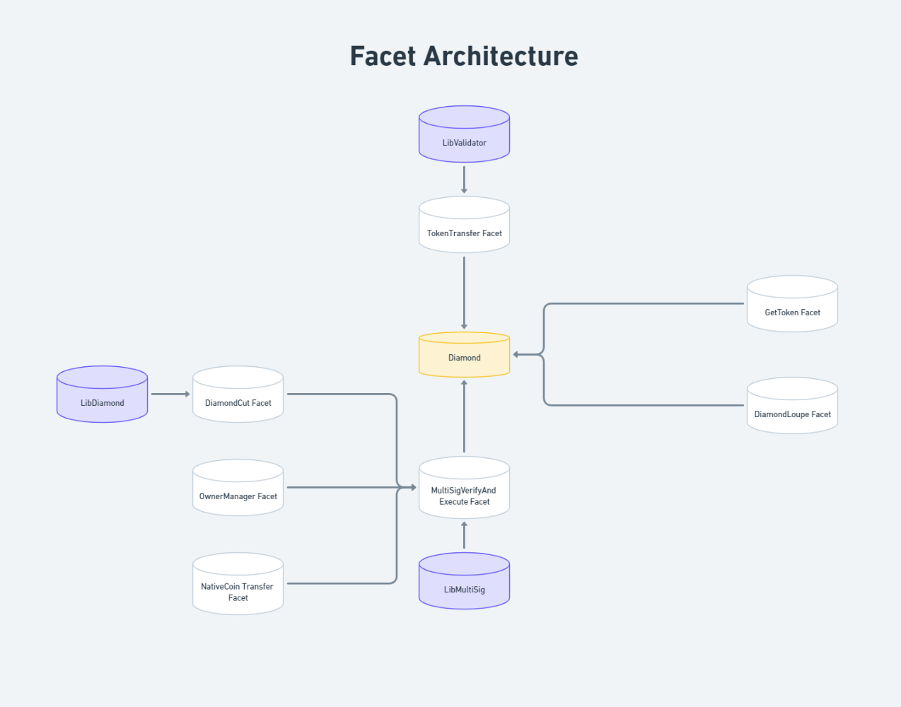
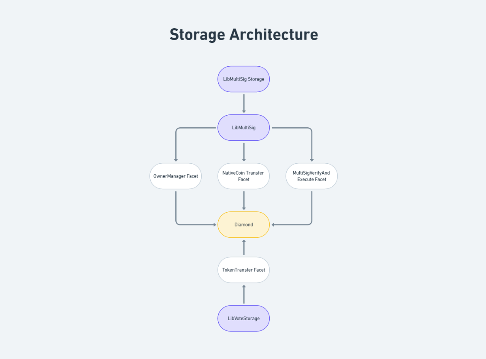

# Description

Smart Contract Wallet is based on proxy pattern shared in EIP-2535 Diamond.
Diamond Proxy Pattern shared in EIP-2535 is imposed to support the smart contract wallet's modularity and upgradability

Smart Contract Wallet is suitable to 
1. transfer ETH with multi-signature feature.
2. transfer ERC721 and ERC20 tokens through community vote feature and set Owners of Smart Contract.
3. flexible upgrade through diamondCut() with multi-sig validation.

Wallet is initialized with any number of signer addresses and custom threshold.
with default facet contracts to support transfer ETH and tokens with special features.
Owners and facets could be added or removed any time to upgrade the wallet.

## Facet & Storage Architecture

### Facet Architecture Diagram



### Storage Architecture Diagram


## Facets

1. `DiamondCut Facet`
2. `DiamondLoupe Facet`
3. `GetToken Facet`
4. `MultiSigVerifyAndExecute Facet`
5. `NativeCoinTransfer Facet`
6. `OwnerManager Facet`
7. `TokenTransfer Facet`

## Features to Add, Remove Owners

1. Functions as a multisig wallet for modifying owners of wallet.

2. Support easy Addition and Removal through Sentinel-based owner management.

3. Thresholds could be modified with owner's multi signature.

## Features for Native Coin Transfer

1. Functions as a multisig wallet to transfer native coin.

2. Support transfer of native coin only through multiSig features.

## Features for Token Transfer

1. Able to Create Proposals to transfer ERC20 and ERC721 tokens.

2. Proposal starts in the selected time and last until the duration which is both set by the proposer

3. Proposer could select duration to receive votes from the community.

4. Community user(including the proposer) is able to execute the proposal after the duration.

## Features for flexible upgrade of smart contract wallet

1. Enables upgrade of smart contract wallet through multi-sig validation.

2. Support Addition/Removal/Replace of facets simultaneously through diamond.

3. Allows transparent view of the diamond through diamond loupe.

## Install dependencies
```
yarn
```

## Run Test
```
yarn hardhat test
```